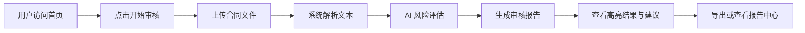

# 智能合同审核系统 - 产品需求文档（PRD）

## 1. 产品概述

智能合同审核系统面向法务、企业管理者及合同经办人员，提供一站式合同风险识别与合规审查服务。用户上传合同文本后，系统自动解析条款、识别潜在风险并生成结构化审核报告，帮助用户快速定位问题、降低法律风险。

产品定位为一款“专业、可信、高效”的 AI 辅助合同审查工具，目标用户为中小型企业法务团队、自由律师及高频处理合同的业务人员。

## 2. 核心功能

### 2.1 用户角色

| 角色 | 注册方式 | 核心权限 |
|------|----------|----------|
| 普通用户 | 无需注册，本地使用 | 上传合同、查看审核结果、导出报告 |

### 2.2 功能模块

1. **首页（Home）**：产品价值展示、核心能力介绍、快速开始入口。
2. **审核工作台（Review）**：合同上传、AI 审核进度、风险结果高亮、条款解析与修改建议。
3. **报告中心（Reports）**：历史审核记录列表、报告详情查看、报告导出。

### 2.3 页面详情

| 页面名称 | 模块名称 | 功能描述 |
|----------|----------|----------|
| 首页 | Hero 区域 | 展示产品主标语、核心卖点、一键进入工作台 |
| 首页 | 能力展示 | 三张能力卡片：风险识别、条款解析、合规建议 |
| 首页 | 使用流程 | 四步流程：上传 → 解析 → 审核 → 导出 |
| 审核工作台 | 上传区域 | 拖拽或点击上传 DOCX / PDF / TXT 文件，显示文件信息 |
| 审核工作台 | 审核进度 | 模拟 AI 解析进度：文本提取 → 条款分析 → 风险评估 → 报告生成 |
| 审核工作台 | 结果展示 | 左侧原文（带风险高亮），右侧风险列表与修改建议 |
| 审核工作台 | 快捷操作 | 重新上传、查看完整报告、导出 PDF |
| 报告中心 | 历史列表 | 按时间倒序展示已审核合同，含文件名、状态、风险等级、时间 |
| 报告中心 | 报告详情 | 查看风险详情、条款评分、系统建议，支持关闭返回列表 |

## 3. 核心流程

用户进入首页后，点击“开始审核”进入审核工作台；在工作台中上传合同文件，系统模拟 AI 处理流程并展示解析进度；审核完成后，用户可在左侧原文查看高亮风险，右侧查看风险分类、等级与修改建议；用户可选择导出报告或返回首页；所有审核记录保存至本地状态，可在报告中心随时查看历史记录。

## 4. 用户界面设计

### 4.1 设计风格

- **主色调**：深海军蓝 `#0B1B33` 作为背景与主色，营造专业、沉稳的法律科技氛围；金色 `#C9A227` 作为强调色，用于按钮、高亮与关键数据；奶油白 `#F7F5F0` 作为卡片与内容区底色。
- **按钮风格**：主按钮使用金色填充 + 深蓝文字，悬停时轻微上浮并加深阴影；次按钮使用描边 + 金色文字。
- **字体**：标题使用 `Playfair Display`（衬线体，传达权威与信赖感），正文使用 `Plus Jakarta Sans`（现代无衬线，清晰易读）。
- **布局风格**：桌面端优先，采用宽幅卡片 + 非对称留白；工作台使用左右分栏（原文 + 风险面板）。
- **图标/装饰**：使用 Lucide 图标；背景加入细腻的网格纹理与金色微光点缀，提升质感。

### 4.2 页面设计概述

| 页面名称 | 模块名称 | UI 元素 |
|----------|----------|---------|
| 首页 | Hero 区域 | 大标题衬线字体、金色 CTA 按钮、深蓝渐变背景、金色装饰线 |
| 首页 | 能力展示 | 三列卡片、图标 + 标题 + 描述、奶油白卡片、悬停上浮 |
| 首页 | 使用流程 | 四步横向时间线、步骤编号圆环、连线动画 |
| 审核工作台 | 上传区域 | 虚线边框拖拽区、文件图标、格式提示、上传后文件卡片 |
| 审核工作台 | 进度指示 | 四步进度条、当前步骤脉冲动画、完成状态图标 |
| 审核工作台 | 结果展示 | 左侧原文区域（风险高亮标签）、右侧风险抽屉（等级、分类、建议） |
| 报告中心 | 历史列表 | 表格行卡片、风险等级徽章、操作按钮 |
| 报告中心 | 报告详情 | 顶部概览（评分 + 统计）、风险条目折叠面板、金色强调数据 |

### 4.3 响应式适配

- 桌面端优先，最大内容宽度 1280px。
- 平板端：工作台左右分栏变为上下堆叠；首页能力卡片变为 2 列。
- 移动端：导航栏折叠为汉堡菜单；报告列表改为卡片式垂直布局。

### 4.4 交互动效

- 页面加载：标题与卡片依次淡入上浮（stagger 0.1s）。
- 按钮悬停： translateY(-2px) + 阴影加深，过渡 0.2s ease。
- 进度条：当前步骤使用脉冲光圈；完成步骤以勾选图标替换数字。
- 风险高亮：原文风险句段使用金色底纹 + 左侧竖线；悬停时展开提示。
- 报告列表：行悬停时背景色过渡，操作按钮显现。
