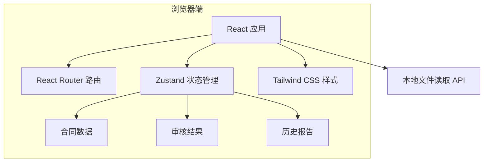

# 智能合同审核系统 - 技术架构文档

## 1. 架构设计

系统采用纯前端架构，所有数据与状态在浏览器端维护，无需后端服务即可运行演示。通过 React + TypeScript + Vite + Tailwind CSS 构建，使用 Zustand 管理全局状态，模拟 AI 合同审核流程。



## 2. 技术选型

- **前端框架**：React 18 + TypeScript
- **构建工具**：Vite
- **样式方案**：Tailwind CSS 3
- **状态管理**：Zustand
- **路由方案**：React Router DOM
- **图标库**：lucide-react
- **字体**：Google Fonts - Playfair Display + Plus Jakarta Sans
- **初始化模板**：react-ts（纯前端项目模板）
- **包管理器**：根据环境自动选择 pnpm 或 npm

## 3. 路由定义

| 路由 | 用途 |
|------|------|
| `/` | 首页，展示产品价值与快速入口 |
| `/review` | 审核工作台，上传合同并查看审核结果 |
| `/reports` | 报告中心，查看历史审核记录与详情 |

## 4. 数据模型

### 4.1 风险等级枚举

```typescript
type RiskLevel = 'high' | 'medium' | 'low';
```

### 4.2 合同风险条目

```typescript
interface ContractRisk {
  id: string;
  clause: string;        // 风险条款原文摘要
  startIndex: number;    // 在原文中的起始位置
  endIndex: number;      // 在原文中的结束位置
  level: RiskLevel;      // 风险等级
  category: string;      // 风险分类，如“付款条款”“违约责任”“知识产权”
  description: string;   // 风险说明
  suggestion: string;    // 修改建议
}
```

### 4.3 审核报告

```typescript
interface ReviewReport {
  id: string;
  fileName: string;
  fileSize: number;
  uploadTime: string;
  status: 'reviewing' | 'completed';
  score: number;         // 合同健康分（0-100）
  risks: ContractRisk[];
  summary: string;       // 审核总结
}
```

### 4.4 全局状态

```typescript
interface AppState {
  reports: ReviewReport[];
  currentReport: ReviewReport | null;
  addReport: (report: ReviewReport) => void;
  setCurrentReport: (report: ReviewReport | null) => void;
  updateReport: (id: string, updates: Partial<ReviewReport>) => void;
}
```

## 5. 项目结构

```
demo3/
├── .trae/documents/        # PRD 与技术架构文档
├── public/                 # 静态资源
├── src/
│   ├── components/         # 可复用组件
│   ├── pages/              # 页面组件
│   ├── hooks/              # 自定义 Hooks
│   ├── stores/             # Zustand 状态管理
│   ├── utils/              # 工具函数
│   ├── data/               # 模拟数据与风险规则
│   ├── types/              # TypeScript 类型定义
│   ├── App.tsx             # 根组件与路由
│   └── main.tsx            # 入口文件
├── index.html
├── package.json
├── tailwind.config.js
├── tsconfig.json
└── vite.config.ts
```

## 6. 核心模拟逻辑说明

由于本版本为前端演示，合同审核通过预设风险规则与正则匹配实现：

1. **文本提取**：用户上传 `.txt` 文件时直接读取文本内容；上传 `.docx` 或 `.pdf` 时，系统回退到一份预设的演示合同文本，避免依赖复杂解析库。
2. **风险识别**：根据关键词库与正则表达式扫描文本，识别如“违约金过高”“付款周期不明确”“知识产权归属模糊”等典型风险。
3. **评分计算**：基于风险数量与等级加权计算合同健康分（高风险 -15、中风险 -8、低风险 -3）。
4. **报告生成**：将匹配结果封装为 `ReviewReport`，保存至全局状态并在报告中心展示。

后续可扩展为接入真实 NLP/LLM 后端服务，将前端状态中的模拟数据替换为 API 响应。
